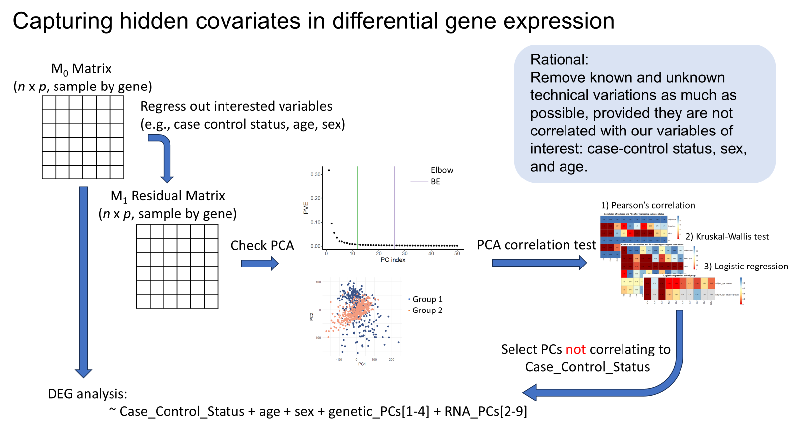

# Batch Correction by PCs

This repository provides R workflows for capturing and adjusting hidden covariates in RNA-seq differential gene expression analysis using principal components (PCs) derived from residualized expression data.

The key idea is to estimate hidden expression variation from a residualized RNA-seq matrix, then include only selected RNA-derived PCs as covariates in the final differential expression model. Because RNA-seq signals can be stronger than signals in GWAS or eQTL studies, RNA PCs may capture true biological signal as well as unwanted technical variation. Therefore, PCs should not be added blindly to the differential expression model.

## Workflow illustration

The diagram below summarizes the overall strategy: residualize expression while protecting biological variables, perform PCA on the residual matrix, screen PCs for association with the signal of interest, and include only retained RNA PCs in the final model.



## Repository contents

```text
Batch_correction_by_PCA/
├── README.md
├── LICENSE
├── .gitignore
├── figures/
│   └── batch_correction_by_pca_workflow.png
└── R/
    ├── batch_correction_by_pca_binary.R
    └── batch_correction_by_pca_continuous.R
```

## When to use each script

Use `R/batch_correction_by_pca_binary.R` when the main variable of interest is binary, such as:

- Disease case/control status
- exposure yes/no status
- treatment/control group

Use `R/batch_correction_by_pca_continuous.R` when the main variable of interest is continuous, such as:

- clinical severity score
- exposure burden score
- quantitative phenotype

## Required R packages

```r
install.packages(c("dplyr", "ggplot2"))

if (!requireNamespace("BiocManager", quietly = TRUE)) {
  install.packages("BiocManager")
}

BiocManager::install(c("edgeR", "limma"))
```

## Input data

The workflow expects two main inputs:

1. A raw count matrix or normalized expression matrix with genes in rows and samples in columns.
2. A metadata table with one row per sample.

The sample IDs in the metadata must match the column names of the expression matrix.

Example metadata columns:

```text
Sample
subject_type
age_at_sample_date
sex
Batch
library_type
all_PC1
all_PC2
all_PC3
all_PC4
```

Optional cell-type proportion covariates can also be included:

```text
CD4T_DNA
CD8T_DNA
Mono_DNA
NK_DNA
Bcell_DNA
Neu_DNA
```

## Overall workflow

### Step 1: Residualize expression while protecting variables of interest

First, regress out variables that should be protected. These are variables whose biological signal should not be removed, such as case/control status, exposure status, age, sex, or subject type.

```r
source("R/batch_correction_by_pca_binary.R")

protected_covariates <- c(
  "exposure_group",
  "sex",
  "age_at_sample_date",
  "subject_type"
)

pc_results <- get_residual_expression_pcs(
  expr = log2cpm_matrix,
  meta = metadata,
  sample_col = "Sample",
  protected_covariates = protected_covariates,
  n_pcs = 20
)

metadata_with_pcs <- pc_results$meta_with_pcs
```

The output includes:

- `residual_exprs`: residualized expression matrix with samples in rows and genes in columns
- `pca_result`: PCA result from `prcomp()`
- `scores`: PC scores for all samples
- `meta_with_pcs`: metadata table with added `RNA_PC` columns
- `pc_cols`: names of the added RNA PC columns

### Step 2: Choose candidate PCs

Use a scree plot, elbow method, or other diagnostic criteria to choose the candidate number of PCs.

```r
plot_scree(pc_results$pca_result, max_pcs = 50)
```

For example, if the elbow method suggests 10 PCs, define:

```r
candidate_pcs <- paste0("RNA_PC", 1:10)
```

### Step 3: Select PCs carefully

This is the key step. RNA-derived PCs can capture the main biological signal of interest. PCs associated with the signal of interest should be excluded from the final model covariates.

## PC selection for a binary main variable

For a binary main variable, such as disease case/control status or exposure yes/no status, use:

```r
source("R/batch_correction_by_pca_binary.R")
```

The binary workflow excludes PCs using three checks:

1. **Point-biserial correlation test** between each candidate RNA PC and the binary signal of interest. PCs with `p < 0.05` are excluded.
2. **Kruskal-Wallis test** between each candidate RNA PC and the binary signal of interest. PCs with `p < 0.05` are excluded.
3. **Logistic regression** with the binary signal of interest as the outcome and each RNA PC tested one at a time, adjusting for the same non-RNA-PC covariates used in the DEG model. PCs with FDR-adjusted logistic-regression p-values `< 0.05` are excluded.

Example:

```r
logistic_covariates <- c(
  "age_at_sample_date",
  "sex",
  "subject_type",
  "Batch",
  "library_type",
  "all_PC1",
  "all_PC2",
  "all_PC3",
  "all_PC4",
  "CD4T_DNA",
  "CD8T_DNA",
  "Mono_DNA",
  "NK_DNA",
  "Bcell_DNA",
  "Neu_DNA"
)

pc_selection <- select_rna_pcs_binary(
  meta = metadata_with_pcs,
  pc_cols = candidate_pcs,
  signal_col = "exposure_group",
  logistic_covariates = logistic_covariates,
  reference_level = "No",
  case_level = "Yes",
  association_p_cutoff = 0.05,
  logistic_fdr_cutoff = 0.05,
  adjust_method = "fdr"
)

pc_selection$selection_table
selected_rna_pcs <- pc_selection$included_pcs
excluded_rna_pcs <- pc_selection$excluded_pcs
```

The `selection_table` includes point-biserial p-values, Kruskal-Wallis p-values, logistic-regression p-values, FDR-adjusted logistic-regression p-values, and the final include/exclude decision for each PC.

## PC selection for a continuous main variable

For a continuous main variable, use:

```r
source("R/batch_correction_by_pca_continuous.R")
```

The continuous workflow excludes PCs using three checks:

1. **Pearson correlation test** between each candidate RNA PC and the continuous signal of interest. PCs with `p < 0.05` are excluded.
2. **Spearman correlation test** between each candidate RNA PC and the continuous signal of interest. PCs with `p < 0.05` are excluded.
3. **Covariate-adjusted linear regression** with the continuous signal of interest as the outcome and each RNA PC tested one at a time, adjusting for the same non-RNA-PC covariates used in the final model. PCs with FDR-adjusted p-values `< 0.05` are excluded.

Note: logistic regression requires a binary outcome. For a continuous main variable, the covariate-adjusted analogue is linear regression. If the continuous variable is converted into a binary variable, use the binary workflow.

Example:

```r
adjusted_covariates <- c(
  "age_at_sample_date",
  "sex",
  "subject_type",
  "Batch",
  "library_type",
  "all_PC1",
  "all_PC2",
  "all_PC3",
  "all_PC4",
  "CD4T_DNA",
  "CD8T_DNA",
  "Mono_DNA",
  "NK_DNA",
  "Bcell_DNA",
  "Neu_DNA"
)

pc_selection <- select_rna_pcs_continuous(
  meta = metadata_with_pcs,
  pc_cols = candidate_pcs,
  signal_col = "clinical_score",
  adjusted_covariates = adjusted_covariates,
  correlation_p_cutoff = 0.05,
  linear_fdr_cutoff = 0.05,
  adjust_method = "fdr"
)

pc_selection$selection_table
selected_rna_pcs <- pc_selection$included_pcs
excluded_rna_pcs <- pc_selection$excluded_pcs
```

## Step 4: Run differential expression analysis with selected RNA PCs

The final model should use the original count matrix as input. The residualized expression matrix is used only to estimate RNA PCs.

### Binary variable example

```r
deg_results <- run_limma_voom_with_rna_pcs(
  counts = count_matrix,
  meta = metadata_with_pcs,
  sample_col = "Sample",
  group_col = "exposure_group",
  reference_group = "No",
  case_group = "Yes",
  base_covariates = c(
    "age_at_sample_date",
    "sex",
    "subject_type",
    "Batch",
    "library_type",
    "all_PC1",
    "all_PC2",
    "all_PC3",
    "all_PC4"
  ),
  rna_pcs = selected_rna_pcs,
  cell_prop_covariates = c(
    "CD4T_DNA",
    "CD8T_DNA",
    "Mono_DNA",
    "NK_DNA",
    "Bcell_DNA",
    "Neu_DNA"
  )
)

head(deg_results$deg)
deg_results$deg_summary
```

### Continuous variable example

```r
continuous_results <- run_limma_voom_continuous_with_rna_pcs(
  counts = count_matrix,
  meta = metadata_with_pcs,
  sample_col = "Sample",
  variable_col = "clinical_score",
  base_covariates = c(
    "age_at_sample_date",
    "sex",
    "subject_type",
    "Batch",
    "library_type",
    "all_PC1",
    "all_PC2",
    "all_PC3",
    "all_PC4"
  ),
  rna_pcs = selected_rna_pcs,
  cell_prop_covariates = c(
    "CD4T_DNA",
    "CD8T_DNA",
    "Mono_DNA",
    "NK_DNA",
    "Bcell_DNA",
    "Neu_DNA"
  )
)

head(continuous_results$results)
continuous_results$result_summary
```

## Important notes

- Do not run differential expression analysis directly on the residualized expression matrix.
- Use residualized expression only to estimate RNA PCs.
- Include biological variables of interest in the residualization model so that they are protected.
- Use the original count matrix or original normalized expression matrix for the final model.
- Exclude RNA PCs correlated with the signal of interest before adding RNA PCs to the final model.
- For binary variables, use point-biserial correlation, Kruskal-Wallis test, and covariate-adjusted logistic regression.
- For continuous variables, use Pearson correlation, Spearman correlation, and (optional) covariate-adjusted linear regression.

## License

This code is distributed under the MIT License. See the `LICENSE` file for details.
